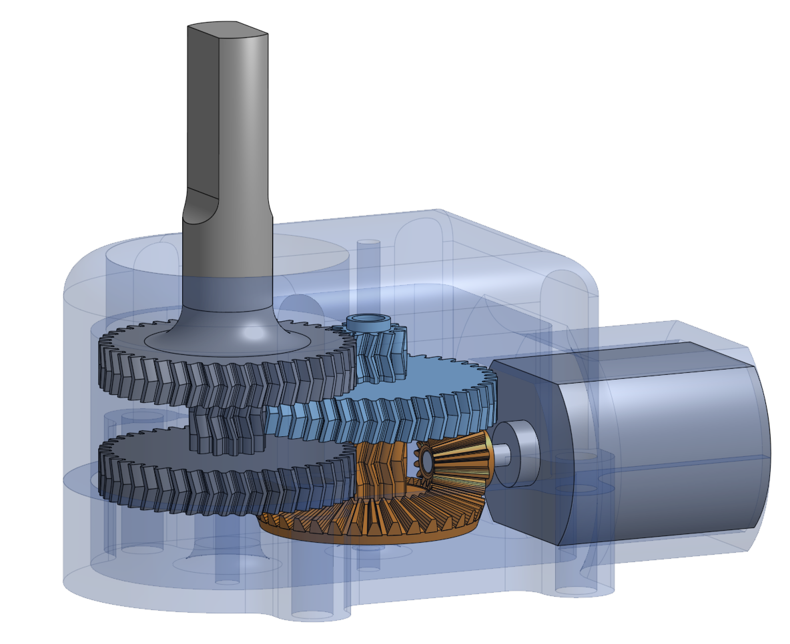

<p align="center">
  
  
</p>
<p align="center"><i>he's just not interested in following the target rn.</i></p>

# Zumito

A small autonomous robot built on an ESP32, written in async Rust with [Embassy](https://embassy.dev). It has a custom 3D-printed chassis, a custom-designed gearbox, dual DC motors driven via MCPWM, and dual ultrasonic sensors (HC-SR04) for target tracking.

## Hardware

- **MCU**: ESP32
- **Motors**: 2x DC motors controlled via ESP32 MCPWM peripheral, with H-bridge direction control
- **Sensors**: 2x HC-SR04 ultrasonic distance sensors
- **Chassis**: 3D-printed
- **Gearbox**: Custom-designed

### Pin mapping

| Function | GPIO |
|----------|------|
| Motor 1 PWM | 25 |
| Motor 2 PWM | 26 |
| Motor 1 direction | 27, 14 |
| Motor 2 direction | 12, 13 |
| Ultrasonic 1 echo / trig | 34 / 32 |
| Ultrasonic 2 echo / trig | 35 / 33 |
| Status LED | 2 |

## Architecture

The firmware is fully async, using Embassy tasks for concurrency on a single-threaded executor:

- **`motor`** — PWM-based dual motor driver with direction control via GPIO H-bridge pins. Motors are controlled through Embassy signals.
- **`ultrasonic`** — Dual HC-SR04 sensor driver. Sensors are measured sequentially to avoid echo interference, with a configurable measure rate (10 Hz) and timeout based on max distance (4m).
- **`net`** — WiFi (STA mode via DHCP) and UDP receiver on port 8080. WiFi credentials are provided at compile time via `SSID` and `PASSWORD` env vars.
- **`control`** — Two control modes:
  - **`pusher`**: autonomous mode that uses dual ultrasonic readings to estimate target position via triangulation and drive toward it.
  - **`manual`**: remote control via UDP, receiving 3-byte motor speed commands from a network client.

There's also a companion web-based remote control app in `zumito_remote_control/` (Axum + Askama).

## Build and flash

Install Rust (via [rustup](https://www.rust-lang.org/tools/install)) and the esp-rs toolchain (via [espup](https://docs.esp-rs.org/book/installation/riscv-and-xtensa.html)).

Set WiFi credentials and flash:
```bash
SSID="your_ssid" PASSWORD="your_password" cargo run --release
```

## TO-DO
- support motors using ESP32 MCPWM ✅
    - support dual motors ✅
    - support changing direction ✅
- add ultrasonic sensor support ✅
    - add dual sensor support ✅
- add manual control over wifi
    - connect to wifi ✅
    - define simple protocol via UDP for controlling motors
    - create client that will send UDP datagrams to device
- simplify codebase, remove bullshit
    - simplify motor module ✅
    - simplify ultrasonic module ✅
    - simplify net module

## Resources
- [Async Rust in Embedded Systems with Embassy - Dario Nieuwenhuis](https://www.youtube.com/watch?v=H7NtzyP9q8E): excellent introduction to embassy and async flow in embedded systems
- [esp-hal examples](https://github.com/esp-rs/esp-hal/tree/main/examples/): took many ideas from here, the docs are really good also.
- [Embassy Book](https://embassy.dev/book/): lots of info